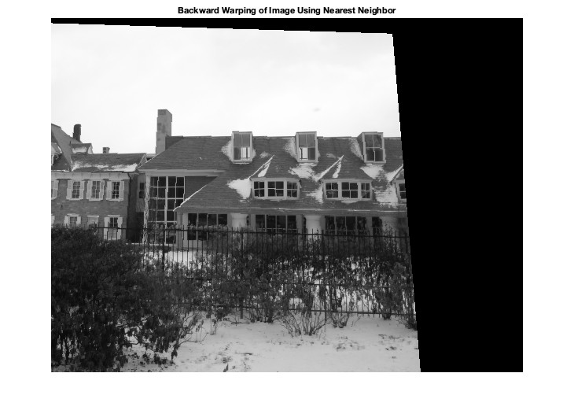

# Homography Matrix and Image Warping

### Description:

This project implements an efficient and robust method for estimating the homography between a pair of images and applies image warping techniques to achieve perspective transformations.

### Input:

The user can select as many points as they want, however, points on both images should match up to produce the best results. 
Source Image (preselected points):  
Destination Image (preselected points):  

### Output:

Forward Warping:  
Backward Warping Using Nearest Neighbor Method:  
Backward Warping Using Bilinear Method:  
Backward Warping Using Interp2 Function: 
